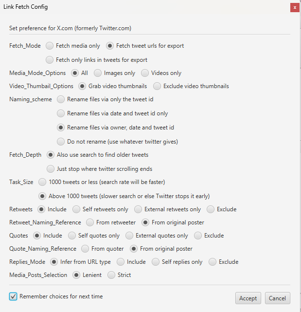

### This is the server and client for furryslop.com

### You can host your own furry slop!

#### Download Twitter Likes

1. Get https://www.wfdownloader.xyz/download 
2. Under Tasks, select Import Browser Cookies
3. Using some cookie editor (I used https://chromewebstore.google.com/detail/cookie-editor/hlkenndednhfkekhgcdicdfddnkalmdm?hl=en) get your `auth_token` by pressing "Save" and pasting it in WFDownloader
4. Edit your config with the following.

5. Follow the other instructions in WFDownloader
6. Click buttons to make it start collecting links
7. After links are collected, you will have to click "start" to download them.

#### Setup database

1. Install pgAdmin
2. Create a database
3. In Dev.ts, insert the name/password used
4. In Dev.ts, set `RESET_DATABASE` to true
5. run `npm run start` in /server
6. After completion, set `RESET_DATABASE` to false

#### Run server/client

1. Clone this repo
2. run `npm install` in /server and /client
3. in  /server, run `npm start`
4. in /client, run `npm run serve`